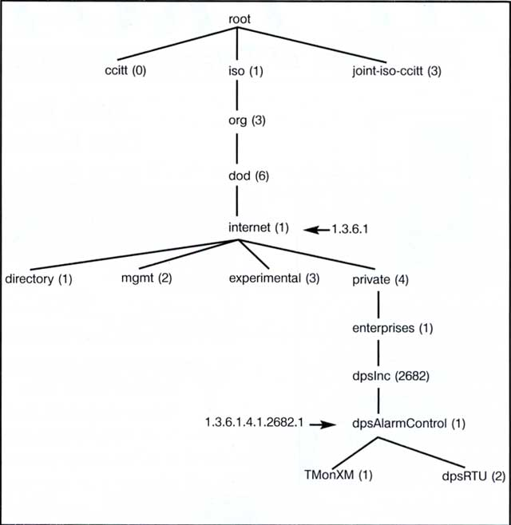
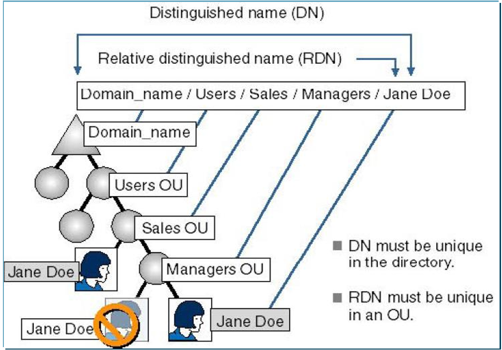
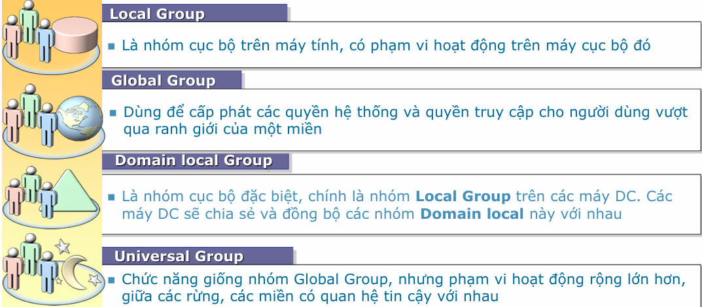

# Basic concept
- **Quản trị mạng** là dùng tool để giám sát và duy trì hoạt động mạng (duy trì ổn định -> ptr mạng to hơn), cần có một cơ chế quản trị vận hành trơn tru từ đầu for max effort
- 5 lĩnh vực quản trị mạng:​​
	1. **Configuration Management:** theo dõi và thu nhập thông tin cấu hình mạng cả hard/software -> lưu vào database
	2. **Performance Management**
		- Băng thông, duy trì hiệu năng mạng để đảm bảo truy cập
		- Quy trình: thu thập data -> phân tích data -> thiết lập hiệu năng 
	3. **Accounting Management**
		- Tạo báo cáo về việc sử dụng mạng
		- Quy trình: đo lường -> phân tích resource -> thiết lập hạn ngạch cho từng user
		- Target: resource đc khai thác, sử dụng hiểu quả nhất
	4. **Fault Management**: phức tạp nhất do sập thì ancut nên áp lực phải nhanh
		- Phát hiện, thông báo, ghi nhận error -> khắc phục sao cho có thể dùng đc đã
		- Quy trình: phát hiện -> khắc phục -> ghi nhận để sửa sai
	5. **Security Management:** 
		- Điều khiển truy cập/bảo vệ tài nguyên 
		- Quy trình: Xác định tài nguyên nhạy cảm -> mối quan hệ user vs resource -> theo dõi truy cập đến resource
- Các phương thức quản trị mạng cơ bản
	- **ALERT (aka TRAP):** mỗi khi xảy ra 1 event thì device auto gửi thông báo cho manager, CHỈ EVENT mới thông báo (còn số byte/s ... không qtam)
	- **POLL (aka GET):** manager thường xuyên hỏi thông tin device (must respond)
	- Một số ứng dụng Alert and Poll:
		- Syslog: mỗi khi có sự kiện thì gửi log đến server
		- NetworkView: ping liên tục để xem who die
		- STP: phát hiện loop ➰ bằng cách gửi các gói BPDU và changes mỗi khi thay đổi
- Mô hình nền tảng:
	- Thực thể quản trị: 
	- Entity đc qtri: user 
## SNMP
- Lịch sử:
	- v1 - 1990
	- v2 - 1996
	- v3 - 2003
- Sử dụng UDP protocol
	- Port 161: polling
	- Port 162: trapping
- **SNMP**: QTM đơn giản, cho biết các thiết bị 1 cách chính xác, từ đó quản lý giám sát từ xa toàn mạng 
- Tự động cảnh báo khi switch có 1 port die
- Chạy trên nền và quản lý các thiết bị TCP/IP (ví dụ đk máy giặt, ... = SNMP) 
- Có khả năng shutdown các port trên switch
- **Object ID (OID):** là 1 dãy mã nhận dạng object đó, truy xuất được thông tin của object (PC - RAM, CPU, OS, port, byte/s, name, process, .... Router - cards, ports, byte/s, name, port status, ...) (VD 1.3.6.1.2.1.2.1)
	- Scalar instance index (sub-id): là OID đính thêm để xác định máy (trong TH nhiều máy giống nhau, vd sysName.0 và sysName.1)
	- Dùng từ điển từ đó dò ra đc sysName/ifPhysAddress/.... có nghĩa là gì
- Sử dụng kiến trúc phân tán gồm các hệ quản trị (management system) và các tác nhân (Agent)
- Máy chủ center chạy các phần mềm là NMS, các Node mạng là SNMP Agent
## SNMP infrastructure
- MIB (Management Info Base): Cơ sở thông tin quản lý, object chứa info các object khác (phiên hoạt động, số MB còn trống)
# Thiết bị mạng
## Router 
- Hoạt động ở tầng mạng (tầng 3 mô hình OSI)
- Định tuyến mạng giữa các địa phận với nhau, tìm đường đi đến các switch
- Chức năng: 
	- Main: **Quản lý lưu lượng truy cập** giữa các mạng dựa vào IP, tìm đường đi cho các gói tin trên môi trường liên mạng và forward nó
	- Gửi các thông báo lỗi
	- Kiểm soát tắc nghẽn, chất lượng mạng, ...
- Thành phần:
	- Tập tin cấu hình: OS xử dụng để chạy lệnh và thông số điều khiển
	- Inside
		- **CPU**: như CPU của PC
		- **ROM**: chứa chương trình kiểm tra khởi động
		- **RAM/DRAM**: lưu trữ routing table, cache, buffering, mất khi shutdown/restart
		- **FLASH**: lưu CISCO IOS để cho vào RAM (như ổ cứng lưu image OS)
		- **NVRAM**: lưu trữ file cấu hình backup/startup của router (tắt router đi vx nhớ)
		- **Interface**: là nơi router kết nối với bên ngoài
	- Outside: LAN, WAN, console/AUX
- Cáp:
	- **Thẳng**: thiết bị **khác** loại
	- **Chéo**: thiết bị **cùng** loại
	- Rollover: cấu hình Router
- Cấu hình router
	- User -> đặc quyền -> config
## Switch
- Một thiết bị mạng dùng để **kết nối nhiều thiết bị (máy tính, máy in, server...) trong cùng một mạng nội bộ (LAN)** và cho phép **truyền dữ liệu hiệu quả giữa chúng**.
## Định tuyến (Routing)
- Chỉ đường cho các thiết bị làm sao cho quá trình đường đi là tối ưu nhất, phải có thông tin về mạng đích
- **Routing table (RT)**: lưu thông tin về mạng đích đến và tối đường đi tối ưu
- **Routing Protocol**: ngôn ngữ giao tiếp giữa các Router (cho phép chia sẻ thông tin các network -> router dùng info này để XD và duy trì RT)
	- Chia thành 2 loại cơ bản
		- Static: XD routing table thủ công bởi người quản trị, chỉ đâu đi đấy (cá nhân/mạng nhỏ, thủ công, tuyến đường không thay đổi)
		- Dynamic: phải nghĩ, tự tìm đường đi, router tự làm routing table (enterprise, tự thay đổi khi có sự cố, auto-update)
	- Chọn đường đi theo 2 algorithm cơ bản
		- Distance vector: chọn đường đi theo hướng và distance tới đích
		- Link State: chọn shortest path dựa vào cấu trúc toàn bộ mạng theo trạng thái các đường link mạng 
- **Vùng tự trị (Autonomous System - AS):** là internet nma chia thành các vùng nhỏ hơn, được nối với nhau bởi các Routers, thường sở hữu của 1 công ty hay nhà cung cấp dịch vụ internet, phải đăng kí với cơ quan quản trị để nhận AS của riêng
- Khoảng cách tự trị (Administrative Distance - AD): Đánh giá độ tin cậy của thông tin nhận được từ router 
	- Là một số nguyên từ 0-225: càng thấp càng đáng tin cậy
		- 0 - max tin cậy
		- 255 - không có lưu lượng qua tuyến này/không đc sử dụng để vận chuyển thông tin user
## LAB
- Ping/Connect 2 máy tính dùng cùng 1 lớp (A to A - 10.x.x.x, B to B - 172.x.x.x, C to C - 192.x.x.x.x)
- Muốn kết nối 2 pc thì cần phải có IP (cùng lớp như trên)
- Default gateway: đưa resouce lên router để đến www
# How to config (Router)
```cmd
router>en //enable router 

```


Server related
- DHCP (Dynamic Host Config Protocol): quản lý IP nhanh chóng và tự động 
	- Tự động set IP theo thứ tự (if set mode DHCP), nếu tắt máy -> chuyển IP đó sang máy khác 
	- Server (cố định) Nên ko dùng DHCP (must static)
	- Relay Agent: như 1 router trung gian để tiếp nhận thông tin  
# Window server
- Hệ điều hành cho server, cung cấp dịch vụ mạng, domain work
- Workgroup vs Domain:
	- **Workgroup** (P2P): máy cùng tầng với nhau, tài nguyên nội bộ tự quản lý, sử dụng SAM (security accounts manager) lưu thông tin user
	- **Domain**: client-server, có 1 máy control (Domain Controller - DC) toàn bộ mạng
		- Tài nguyên mạng lưu trữ ở đây thông qua Active directory (AD) với folder **NTDS.DIT**
		- User data store tập trung -> authen cũng tập trung vùng DC
- **Stand-alone**: Là máy tính chạy HĐH Server, tuy nhiên không tham gia domain và cũng không là Domain Controller. 
- **Member Server**: Là máy tính chạy HĐH Server, có tham gia Domain nhưng không phải là Domain Controller.
## Active Directory (AD)
- Framework độc quyền của MS, là 1 **thư mục ko thiểu thiêu**, quản trị tập trung user, computer, device, shared folder, client-server structure
- Quản lý tập trung, bảo mật, group policy, scalebility, ủy quyền quản trị
- **Directory Services folder**:
	- Object: thông tin user, groups, policies, ... (printer, workstation, user, ...)
	- Attribute: phân biệt các object với nhau = thuộc tính (printer's ID, pc's ID, ...)
	- Schema: danh bạ của AD, csdl có cấu trúc (class and attribute object)
	- Container: vật chứa nhiều object bên trong
- **AD framework**
	- AD Logic:
		- Domain: lõi là domain, lưu trữ thông tin object, 1 AD đc tạo bởi nhiều domain, triển khai nhiều physical structure, truy cập thông qua ACLs (access control list)
		- **OU (organizational unit): 1 container** chứa schema trong 1 domain -> nhóm quản trị luận lý (logical), là scope unit nhỏ nhất trong Trees
		- Trees: nhiều domain tập hợp lại
		- Forest: tập hợp nhiều tree (mỗi tree độc lập, domain khác nhau)
		- Site: vị trí địa lý của các domain trong hệ thống
	- AD vật lý:
		- Domain Controller (DC): 1 máy tính cài win server, có bản sao của AD, authen, xử lý requests
	- **AD domain server (ADDS):** cung cấp authen và xác nhận access (IDA - Identity and access) cho mạng, đảm bảo an ninh cho resource (Framework: store data, authen, give access, tracking)
	- ADC (Additional DC): là backup cho PDC (primary DC) 
	- RODC (Read-only DC): testing field cho những máy ch authen done (không hiệu quả nếu đông -> Credential Caching - lưu authen)
## Group and User management
- Naming Space: AD space dựa trên name space của DNS -> phân giải tên 
- User account: dùng để dnhap vào domain, máy (authen, author, audit)
	- Local User Account: chỉ tạo ra từ máy local (COMPMGMT.MSC - bulk create local acc)
	- Domain User Account: tạo ra trên 1 DC, cho phép log-on vào mạng bất kì trên máy trạm thuộc domain (DSA.MSC - tạo từ Active Dir User and Comp), chứa trong NTDS.DIT nên máy default có 1 folder NTDS
- **Distinguished Name (DN):** Tên duy nhất xác định một đối tượng trong AD.
- Group account: đại diện 1 gr user, quản lý nhóm, phân bổ resource, chỉ dùng để quản lý, KHÔNG được log in
	- Security Group: dùng cho security related work, chỉ định SID (security identifier), gửi email cho user trong group
		- Distribution Group: không thể đi gán quyền, làm mấy việc ko phải của security, không có SID/ACL
		
- OU management: giảm công việc cho người quản trị = ủy quyền
## Policies 
- System policy
	- Account policies: MK, khóa tài khoản -> set xem MK nên hết hạn bao lâu, yêu cầu pass như nào, ... 
	- Local Policies: khả năng audit, quyền hệ thống, security choices 
	- IP Security: tác động security, bộ lọc
- Group policy: kiểm soát setting hệ thống PC
	- Chỉ xuất hiện trên hệ thống miền AD, quản lý bảo mật vượt trội hơn so với System Poli
	- Triển khai nhiều cấp độ: Site, Domain, OU
	- Auto hủy khi vứt bỏ, áp dụng thường xuyên hơn
	- Cấu hình trên GPO (GP object): 2 loại local GPO (từng máy), non local GPO (lưu trên AD) (**gpedit.msc**)
	- Thừa kế (local -> Site-> domain -> OU), có tính tích lũy, có thể force/cấm thừa kế
	- Trong trường hợp ta có 2 GPO có nội dung là mâu thuẫn nhau, và được áp đặt trên 2 cấp độ khác nhau là Domain và OU. Thì, những người dùng trong những OU hiện hành sẽ chịu sự tác động của GPO đang áp đặt ở cấp độ thấp hơn (GPO áp đặt trên OU)
## Permission
- Định nghĩa xem object có thể truy cập cái gì
- 2 hệ thống kiểm soát user 
	- Quyền chia sẻ (Share Permission): kiểm soát shared resource
	- NTFS permission: kiểm soát trên hệ thống NTFS (cảm giác như định dạng đặc biệt để bảo mật cao, đòi người ngoài CŨNG PHẢI CÓ quyền NTFS mới truy cập đượcf)
- Để truy cập đc 1 resource được chia sẻ thì phải có share per và phù hợp quyền NTFS
- Window dùng ACL để kiểm soát tài nguyên, 1 ACL gồm nhiều ACE (AC entry)
- Trong folder Properties: Sharing -> share per, Security -> NTFS
- Session cho phép xem thông tin ai truy cập đến folder 
- 2 loại hệ thống cho partition và volume 
	- FAT - File Allocation Table (FAT16/32): ko hỗ trợ bảo mật local, ai cx có thể vào 
	- NTFS - New Tech File Sys: bảo mật tốt hơn vì đòi authen liên tục
	- Quyền DENY là vua, mạnh hơn hẳn các quyền khác
# Bảo mật mạng
- Secure info là bảo vệ data từ bất kỳ truy cập trái phép nào
- Secure mạng là bảo vệ data trên môi trường internet:
	- What to secure: data, resource, fame, ... if not, cause money/time/fame/opport/system loss
- **LƯU Ý: Khả năng truy cập tỉ lệ nghịch với khả năng bảo mật hệ thống.**
- Data properties
	- Bí mật: bí mật và đúng đối tượng
	- Toàn vẹn: đầy đủ, nguyên vẹn structure
	- Sẵn sàng: luôn sẵn sàng để tiếp cận
	- Chính xác: thông tin chính xác, tin cậy
	- Chống khước từ: khả năng có thể kiểm chứng được source data
- **Threat**: là các hành động có khả năng xâm hại đến an toàn hệ thống
	- Target: dịch vụ an ninh (WWW, DNS, ...)
	- Đối tượng (Agent): là chủ thể bị attacked
- **Vulnerable**: lỗ hổng từ bên trong hệ thống (back-door, OS, ứng dụng, vật lý, quản lý)
- **Risk** (nguy cơ hệ thống): threat + Vulnerable
	- 3 cấp độ: cao, trung bình, thấp
		- **Xác định lỗ hổng**: xem khởi nguyên từ đâu: điểm nối internet, từ xa, tổ chức khác, truy cập vật lý, user, wifi -> cần xem thông tin có thể truy cập và mức độ access)
		- **Ảnh hưởng của nó**: khó vì không rõ ràng, xét các hình thức phổ biến (DDoS, virus, ...), thời điểm tấn công, quy mô
		- **Biện pháp**
## Attack strategy (RISK)
### Scanning attack 
- Chủ yêu để xem cấu hình của hệ thống -> planning
- Scanning type:
	- Port scanning: gửi 1 loạt thông điệp này rồi xem cổng nào đang mở -> check xem máy chủ đang dùng dịch vụ gì (Nmap - Network Mapper)
	- Vulnerability scanning: quét lỗi nội bộ -> lỗ hổng từ server -> planning attack
	- Network scanning: xác định các máy đang hoạt động trên hệ thống mạng
### Spoofing Attack
- Fake IP để quét hệ thống -> tránh phát hiện
- Source routing: attacker chỉ định gói tin
### Hijacking Attack
- Session: chiếm quyền server vs client -> steal cookie
- Spoofing vs Hijack: 1 cái giả mạo qua mặt, 1 cái steal
### DoS
- Dạng tấn công làm cho các hệ thống máy chủ, trang web bị tê liệt không thể đáp ứng lại các yêu cầu của người dùng
- Type:
	- Ping of death: Gửi các gói tin IP quá lớn → làm máy nạn nhân quá tải, dẫn đến từ chối dịch vụ
	- LAND attack: Gửi gói tin có địa chỉ IP nguồn và đích giống nhau → gây vòng lặp xử lý, làm treo hệ thống.
	- WinNuke: Tấn công vào **port 139** của Windows → gửi gói tin rác gây tràn bộ đệm
- Vài công cụ tấn công:
	- **CPU hog**: quá tải CPU của hệ thống
	- **Bubonic**: Gửi gói **TCP có thông số ngẫu nhiên** → gây quá tải hoặc làm sập hệ thống.
	- **RPC Locator**: Tấn công **dịch vụ phân phối ứng dụng** trên Windows → gây tràn bộ đệm nếu chưa vá lỗi.
	- **SSPing / Targa**: Gửi gói tin lớn làm **tê liệt khả năng xử lý dữ liệu** của hệ thống.
### DDoS
- Distribute DoS: tấn công từ nhiều máy tính khác nhau -> too strong + ẩn danh -> RIP fr fr
- Các thành phần 
	- **Master / Handler**: Máy chủ điều khiển trung tâm.
	- **Slave / Zombie / Bot**: Các máy tính bị nhiễm mã độc, điều khiển từ xa.
	- **Victim (nạn nhân)**: Máy chủ, hệ thống bị tấn công.
- Ngăn chặn từ sớm
	- Network-ingress filtering: Lọc gói tin đầu vào để loại bỏ gói tin từ địa chỉ IP giả.
	- Rate-limiting (Traffic shaping): Giới hạn băng thông cho từng dịch vụ/giao thức.
	- 🧠 Giám sát và phát hiện
		- Intrusion Detection System (IDS): Phát hiện truy cập trái phép và luồng tấn công.
		- Host-auditing tool: Kiểm tra các file hệ thống để tìm mã độc hoặc botnet.
		- Network-auditing tool: Quét mạng phát hiện máy tính đang làm zombie.
		- Tìm công cụ DoS: Dùng phần mềm như Find_ddos, SARA, Zombie Zapper để phát hiện mối nguy.
	- 🔧 Bảo vệ và vá lỗi
		- Tắt dịch vụ không cần thiết: Đóng port, hạn chế dùng hàm dễ bị khai thác (get, strcpy…).
		- Chặn ICMP: Cấu hình firewall chặn các gói tin ICMP từ bên ngoài (giảm nguy cơ bị Ping of Death).
		- Cập nhật hệ thống: Vá lỗi hệ điều hành và phần mềm thường xuyên.
		- Dùng phần mềm bảo vệ chuyên dụng: IntelliGuard DPS, FortGuard, NetScaler…
### Backdoor attack
- Cài third party lên client để bú 
## Biện pháp bảo mật
### IDS
- IDS (Intrusion Detection System): hệ thống giám sát lưu thông mạng
	- Có thể phân biệt được threat nội, ngoại
	- Detect các dấu hiệu bất thường hoặc lưu lượng mạng khác thường -> Threat
	- Đảm bảo tính toàn vẹn dữ liệu, giữ bí mật thông tin, tạo riêng tư cho user, alert liên tục
	- GIÁM SÁT (lưu lượng mạng và hành vi khả nghi) - CẢNH BÁO - BẢO VỆ (rollback về default config để ngăn chặn)
	- Phân biệt được tấn công nội ngoại và phát hiện bất thường so vs default config
- Network Base IDS (NIDS): cắm mắt (sensor) để giám sát mạng ở pin point
	- So sánh các mẫu attack đã được train 
	- Thường setup giữa mạng nội và ngoại để track lưu lượng
	- Advantage: vô hình, giám sát được nhiều, phát hiện ở tầng network, ...
	- Disadvantage: false positive, không phát hiện được data đã mã hóa, có độ trễ, cần update signature liên tục, ...
- Host-based IDS (HIDS): cài trên máy chủ, theo dõi từ trong máy luôn, xem cái gì bị đổi từ đó so sánh các default để cảnh báo
### Firewall
- Các vùng mạng
	- Local - LAN: máy trạm/chủ quản lý nội bộ
	- DMZ (Demilitarized Zone): trung lập giữa LAN và internet (ncl medium trước khi ra ngoài: DNS, FTP, ....)
	- Server Farm: host không trực tiếp cấp internet
	- Internet: kết nối toàn cầu
- Là một hệ thống an ninh mạng, có thể dựa trên phần cứng hoặc phần mềm. Hoạt động như một rào chắn giữa mạng an toàn và mạng không an toàn.
- Chính sách tường lửa, allow/denied data vào ra
- Phân loại:
	- Network FW: đặt ở ranh giới mạng
	- Host FW: trên máy chủ
	- Software: phần mềm trên máy
	- Hardware: built-in phần cứng
	- Packet Filter: Hoạt động ở Layer 3– 4 (Mô hình OSI) 
	- Application Filter: Hoạt động ở Layer 7 
	- State Full Filter: Hoạt động từ Layer 3– 7
- Các mô hình triển khai Firewall phổ biến:
	- Mô hình 1:
		- Tách biệt mạng Internet, nội bộ, và DMZ.
		- Đặt Firewall giữa các vùng để kiểm soát truy cập.
	- Mô hình 2:
		- Firewall giữa Internet ↔ DMZ và DMZ ↔ nội bộ.
		- Mạng nội bộ được bảo vệ bởi 2 lớp firewall.
	- Mô hình 3:
		- Firewall ở cả 3 ranh giới: Internet ↔ DMZ, DMZ ↔ nội bộ, và nội bộ ↔ Internet.
		- Mọi truy cập giữa các vùng đều được kiểm soát.
- Firewall kiểm soát truy cập dựa trên các luật (rules).
	- Chiều gói tin (inbound/outbound)
	- Giao thức (TCP/UDP)
	- IP nguồn
	- Cổng nguồn
	- IP đích
	- Cổng đích
	- Hành động (Allow/Deny)


