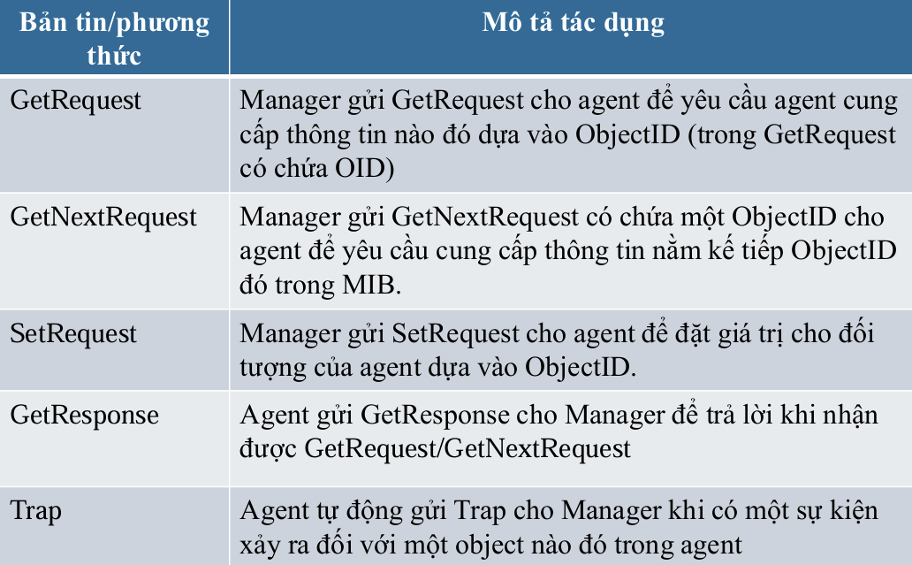
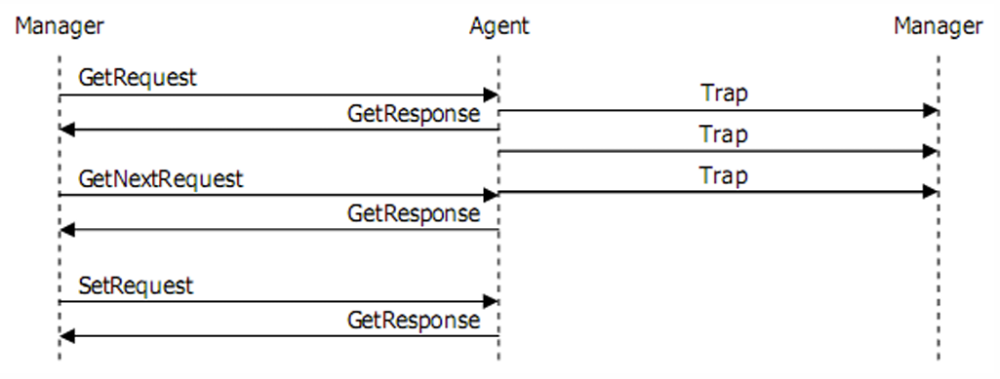

# Basic concept
- **Quản trị mạng** là dùng tool để giám sát và duy trì hoạt động mạng (duy trì ổn định -> ptr mạng to hơn), cần có một cơ chế quản trị vận hành trơn tru từ đầu for max effort
- 5 lĩnh vực quản trị mạng:​​
	1. **Configuration Management:** theo dõi và thu nhập thông tin cấu hình mạng cả hard/software -> lưu vào database
	2. **Performance Management**
		- Băng thông, duy trì hiệu năng mạng để đảm bảo truy cập
		- Quy trình: thu thập data -> phân tích data -> thiết lập hiệu năng 
	3. **Accounting Management**
		- Tạo báo cáo về việc sử dụng mạng
		- Quy trình: đo lường -> phân tích resource -> thiết lập hạn ngạch cho từng user
		- Target: resource đc khai thác, sử dụng hiểu quả nhất
	4. **Fault Management**: phức tạp nhất do sập thì ancut nên áp lực phải nhanh
		- Phát hiện, thông báo, ghi nhận error -> khắc phục sao cho có thể dùng đc đã
		- Quy trình: phát hiện -> khắc phục -> ghi nhận để sửa sai
	5. **Security Management:** 
		- Điều khiển truy cập/bảo vệ tài nguyên 
		- Quy trình: Xác định tài nguyên nhạy cảm -> mối quan hệ user vs resource -> theo dõi truy cập đến resource
- Các phương thức quản trị mạng cơ bản
	- **ALERT (aka TRAP):** mỗi khi xảy ra 1 event thì device auto gửi thông báo cho manager, CHỈ EVENT mới thông báo (còn số byte/s ... không qtam)
	- **POLL (aka GET):** manager thường xuyên hỏi thông tin device (must respond)
	- Một số ứng dụng Alert and Poll:
		- Syslog: mỗi khi có sự kiện thì gửi log đến server
		- NetworkView: ping liên tục để xem who die
		- STP: phát hiện loop ➰ bằng cách gửi các gói BPDU và changes mỗi khi thay đổi
- Mô hình nền tảng:
	- Thực thể quản trị: manager
	- Entity đc qtri: user 
## SNMP
- Lịch sử:
	- v1 - 1990
	- v2 - 1996
	- v3 - 2003
- Sử dụng UDP protocol
	- Port 161: polling
	- Port 162: trapping
- **SNMP**: QTM đơn giản, cho biết các thiết bị 1 cách chính xác, từ đó quản lý giám sát từ xa toàn mạng 
- Tự động cảnh báo khi switch có 1 port die
- Chạy trên nền và quản lý các thiết bị TCP/IP (ví dụ đk máy giặt, ... = SNMP) 
- Có khả năng shutdown các port trên switch
- **Object ID (OID):** là 1 dãy mã nhận dạng object đó, truy xuất được thông tin của object (PC - RAM, CPU, OS, port, byte/s, name, process, .... Router - cards, ports, byte/s, name, port status, ...) (VD 1.3.6.1.2.1.2.1)
	- **Scalar instance index (sub-id):** là OID đính thêm để xác định máy (trong TH nhiều máy giống nhau, vd sysName.0 và sysName.1)
	- Dùng từ điển từ đó dò ra đc sysName/ifPhysAddress/.... có nghĩa là gì
- Sử dụng kiến trúc phân tán gồm các hệ quản trị (management system) và các tác nhân (Agent)
- Máy chủ center chạy các phần mềm là NMS, các Node mạng là SNMP Agent
## SNMP infrastructure
- PDU (Protocol Data Unit): đơn vị data được truyền qua giữa manager và các agent
- **Object Access:** Object SNMP có quyền `READ_ONLY` (chỉ đọc) hoặc `READ_WRITE` (đọc + ghi). Chỉ object `READ_WRITE` mới thay đổi được giá trị.
- MIB (Management Info Base): Cơ sở thông tin quản lý, object chứa info các object khác (phiên hoạt động, số MB còn trống), quản lý các thiết bị chạy TCP/IP gồm các thuộc tính: tên và mã số, data type, description object
- Nhìn chung thì các bản tin dùng để kiểm soát thông tin các device trong mạng lưới
	- GetRequest: trả về OID cx như thông tin device (PDU type = 0)
	- GetNextRequest: duyệt toàn bộ OID trong mạng lưới (do OID xếp không thứ tự nên phải duyệt mới biết cây device trong như nào ms có sơ đồ) (PDU type = 1)
	- SetRequest: yêu cầu Agent chỉnh sửa thông tin (PDU type = 2)
	- GetResponse: Agent return dạ vâng cho manager (PDU type = 3)
	- Trap: không phải lúc nào cx trap, trap khác nhau tùy manufactoring
		- Khác vs mấy cái trên, nó dùng cảnh báo, ko cần phản hồi trong khi kia là để quản lý thiết bị, ngoài ra agent cx có thể trap nhiều receiver 1 lúc
		- Generic trap: 7 loại
		- Specific Trap: đặc thù do user tạo, chỉ hiểu được nếu receiver và sender đều hỗ trợ MIB đó
- Bảo mật trong SNMP
	- Community String: Là chuỗi ký tự giống nhau trên cả **manager** và **agent**, dùng để **xác thực** khi trao đổi dữ liệu (3 loại - bảng dưới). Nếu community string không khớp → agent sẽ **không trả lời**.
	- View: Dù có `read-community`, agent vẫn có thể giới hạn quyền truy cập thông qua “view”. View là một tập con của MIB, chứa các OID cụ thể được phép truy cập. Mỗi view gắn với một community string.
	- SNMP ACL (Access control list): hạn chế truy cập dựa trên IP (dù biết commun string)

| Loại              | Mục đích                                          |
| ----------------- | ------------------------------------------------- |
| `Read-Community`  | Đọc dữ liệu (dùng cho GetRequest, GetNextRequest) |
| `Write-Community` | Ghi/thay đổi dữ liệu (dùng cho SetRequest)        |
| `Trap-Community`  | Xác thực trap gửi từ agent đến trap receiver      |

# Thiết bị mạng
## Router 
- Hoạt động ở tầng mạng (tầng 3 mô hình OSI)
- Định tuyến mạng giữa các địa phận với nhau, tìm đường đi đến các switch
- Chức năng: 
	- Main: **Quản lý lưu lượng truy cập** giữa các mạng dựa vào IP, tìm đường đi cho các gói tin trên môi trường liên mạng và forward nó
	- Gửi các thông báo lỗi
	- Kiểm soát tắc nghẽn, chất lượng mạng, ...
- Thành phần:
	- Tập tin cấu hình: OS xử dụng để chạy lệnh và thông số điều khiển
	- Inside
		- **CPU**: như CPU của PC
		- **ROM**: chứa chương trình kiểm tra khởi động
		- **RAM/DRAM**: lưu trữ routing table, cache, buffering, mất khi shutdown/restart (running-config)
		- **FLASH**: lưu CISCO IOS để cho vào RAM (như ổ cứng lưu image OS) (như SSD của PC)
		- **NVRAM**: lưu trữ file cấu hình backup/startup của router (tắt router đi vx nhớ) (startup-config) (như HDD của PC)
		- **Interface**: là nơi router kết nối với bên ngoài
	- Outside: LAN, WAN, console/AUX
- Cáp:
	- **Thẳng**: thiết bị **khác** loại
	- **Chéo**: thiết bị **cùng** loại
	- Rollover: cấu hình Router
- Cấu hình router
	- User -> đặc quyền -> config
```bash
Router# setup                    # Vào chế độ cấu hình nhanh (Setup mode)
Router> enable                  # Vào chế độ Privileged EXEC
Router# configure terminal      # Vào chế độ cấu hình Global

Router(config)# hostname MyRouter       # Đặt tên Router
MyRouter(config)# enable password cisco # Cấu hình password enable (chưa mã hóa)
MyRouter(config)# enable secret class   # Cấu hình password enable (mã hóa)
MyRouter(config)# service password-encryption  # Mã hóa tất cả password

# Cấu hình line console
MyRouter(config)# line console 0
MyRouter(config-line)# password console123
MyRouter(config-line)# login
MyRouter(config-line)# exit

# Cấu hình line vty cho Telnet
MyRouter(config)# line vty 0 4
MyRouter(config-line)# password telnet123
MyRouter(config-line)# login
MyRouter(config-line)# exit

# Cấu hình line auxiliary
MyRouter(config)# line aux 0
MyRouter(config-line)# password backdoor
MyRouter(config-line)# login
MyRouter(config-line)# exit

# Cấu hình interface Serial 0/0/0
MyRouter(config)# interface serial 0/0/0
MyRouter(config-if)# description Link to ISP           # Mô tả interface (tuỳ chọn)
MyRouter(config-if)# ip address 192.168.10.1 255.255.255.0  # Gán IP + subnet mask
MyRouter(config-if)# clock rate 56000                  # Đặt clock rate nếu là DCE
MyRouter(config-if)# no shutdown                         # Bật interface
MyRouter(config-if)# exit

# Cấu hình interface FastEthernet 0/0
MyRouter(config)# interface fastethernet 0/0
MyRouter(config-if)# description Accounting LAN
MyRouter(config-if)# ip address 192.168.20.1 255.255.255.0
MyRouter(config-if)# no shutdown
MyRouter(config-if)# exit

# Gán hostname cho IP (host mapping)
MyRouter(config)# ip host lodon 172.16.1.3

# Cấu hình định tuyến tĩnh
MyRouter(config)# ip route 10.0.0.0 255.0.0.0 serial 0/0/0
# Xóa định tuyến tĩnh
MyRouter(config)# no ip route 10.0.0.0 255.0.0.0 serial 0/0/0

# Hiển thị thông tin cơ bản
MyRouter# show version          # Thông tin IOS
MyRouter# show interfaces      # Trạng thái tất cả interface
MyRouter# show ip interface brief  # Tóm tắt IP interfaces
MyRouter# show clock            # Xem thời gian hiện tại

# Lưu cấu hình vào NVRAM
MyRouter# copy running-config startup-config

```
## Switch
- Một thiết bị mạng dùng để **kết nối nhiều thiết bị (máy tính, máy in, server...) trong cùng một mạng nội bộ (LAN)** và cho phép **truyền dữ liệu hiệu quả giữa chúng**.
```bash
! Tạo VLAN
Switch# vlan database
Switch(vlan)# vlan 10 name Sales
Switch(vlan)# vlan 20 name Marketing
Switch(vlan)# exit

! Gán cổng vào VLAN
Switch(config)# interface range fa0/1 - 5
Switch(config-if-range)# switchport mode access
Switch(config-if-range)# switchport access vlan 10
Switch(config-if-range)# exit

Switch(config)# interface fa0/6
Switch(config-if)# switchport mode access
Switch(config-if)# switchport access vlan 20
Switch(config-if)# end

! Kiểm tra VLAN
Switch# show vlan brief
Switch# show interface fa0/1 switchport

! Cấu hình VTP Server
Switch# vlan database
Switch(vlan)# vtp server
Switch(vlan)# vtp domain mydomain
Switch(vlan)# exit

! Cấu hình VTP Client
Switch# vlan database
Switch(vlan)# vtp client
Switch(vlan)# vtp domain mydomain
Switch(vlan)# exit

! Cấu hình trunk port
Switch(config)# interface fa0/24
Switch(config-if)# switchport trunk encapsulation dot1q
Switch(config-if)# switchport mode trunk
Switch(config-if)# switchport trunk allowed vlan 10,20
Switch(config-if)# end

! Cấu hình Inter-VLAN Routing (Switch Layer 3)
Switch(config)# ip routing

! Hoặc Inter-VLAN Routing trên Router (Router-on-a-stick)
Router(config)# interface fa0/0
Router(config)# no shutdown
Router(config)# interface fa0/0.10
Router(config-subif)# encapsulation dot1q 10
Router(config-subif)# ip address 192.168.10.1 255.255.255.0

Router(config)# interface fa0/0.20
Router(config-subif)# encapsulation dot1q 20
Router(config-subif)# ip address 192.168.20.1 255.255.255.0

```
## Định tuyến (Routing)
- Chỉ đường cho các thiết bị làm sao cho quá trình đường đi là tối ưu nhất, phải có thông tin về mạng đích
- **Routing table (RT)**: lưu thông tin về mạng đích đến và tối đường đi tối ưu
- **Routing Protocol**: ngôn ngữ giao tiếp giữa các Router (cho phép chia sẻ thông tin các network -> router dùng info này để XD và duy trì RT)
	- Chia thành 2 loại cơ bản
		- Static: XD routing table thủ công bởi người quản trị, chỉ đâu đi đấy (cá nhân/mạng nhỏ, thủ công, tuyến đường không thay đổi)
		- Dynamic: phải nghĩ, tự tìm đường đi, router tự làm routing table (enterprise, tự thay đổi khi có sự cố, auto-update)
	- Chọn đường đi theo 2 algorithm cơ bản
		- Distance vector: chọn đường đi theo hướng và distance tới đích
		- Link State: chọn shortest path dựa vào cấu trúc toàn bộ mạng theo trạng thái các đường link mạng 
- **Vùng tự trị (Autonomous System - AS):** là internet nma chia thành các vùng nhỏ hơn, được nối với nhau bởi các Routers, thường sở hữu của 1 công ty hay nhà cung cấp dịch vụ internet, phải đăng kí với cơ quan quản trị để nhận AS của riêng
- **Khoảng cách tự trị (Administrative Distance - AD):** Đánh giá độ tin cậy của thông tin nhận được từ router 
	- Là một số nguyên từ 0-255: càng thấp càng đáng tin cậy
		- 0 - max tin cậy
		- 255 - không có lưu lượng qua tuyến này/không đc sử dụng để vận chuyển thông tin user
## LAB
- Ping/Connect 2 máy tính dùng cùng 1 lớp (A to A - 10.x.x.x, B to B - 172.x.x.x, C to C - 192.x.x.x.x)
- Muốn kết nối 2 pc thì cần phải có IP (cùng lớp như trên)
- Default gateway: đưa resouce lên router để đến www
Server related
- DHCP (Dynamic Host Config Protocol): quản lý IP nhanh chóng và tự động 
	- Tự động set IP theo thứ tự (if set mode DHCP), nếu tắt máy -> chuyển IP đó sang máy khác 
	- Server (cố định) Nên ko dùng DHCP (must static)
	- Relay Agent: như 1 router trung gian để tiếp nhận thông tin  
# Window server
- Hệ điều hành cho server, cung cấp dịch vụ mạng, domain work
- Workgroup vs Domain:
	- **Workgroup** (P2P): máy cùng tầng với nhau, tài nguyên nội bộ tự quản lý, sử dụng SAM (security accounts manager) lưu thông tin user
	- **Domain**: client-server, có 1 máy control (Domain Controller - DC) toàn bộ mạng
		- Tài nguyên mạng lưu trữ ở đây thông qua Active directory (AD) với folder **NTDS.DIT**
		- User data store tập trung -> authen cũng tập trung vùng DC
- **Stand-alone**: Là máy tính chạy HĐH Server, tuy nhiên không tham gia domain và cũng không là Domain Controller. 
- **Member Server**: Là máy tính chạy HĐH Server, có tham gia Domain nhưng không phải là Domain Controller.
## Active Directory (AD)
- Framework độc quyền của MS, là 1 **thư mục ko thiểu thiêu**, quản trị tập trung user, computer, device, shared folder, client-server structure
- Quản lý tập trung, bảo mật, group policy, scalebility, ủy quyền quản trị
- **Directory Services folder**:
	- Object: thông tin user, groups, policies, ... (printer, workstation, user, ...)
	- Attribute: phân biệt các object với nhau = thuộc tính (printer's ID, pc's ID, ...)
	- Schema: danh bạ của AD, csdl có cấu trúc (class and attribute object)
	- Container: vật chứa nhiều object bên trong
- **AD framework**
	- AD Logic:
		- Domain: lõi là domain, lưu trữ thông tin object, 1 AD đc tạo bởi nhiều domain, triển khai nhiều physical structure, truy cập thông qua ACLs (access control list)
		- **OU (organizational unit): 1 container** chứa schema trong 1 domain -> nhóm quản trị luận lý (logical), là scope unit nhỏ nhất trong Trees
		- Trees: nhiều domain tập hợp lại
		- Forest: tập hợp nhiều tree (mỗi tree độc lập, domain khác nhau)
		- Site: vị trí địa lý của các domain trong hệ thống
	- AD vật lý:
		- Domain Controller (DC): 1 máy tính cài win server, có bản sao của AD, authen, xử lý requests
	- **AD domain server (ADDS):** cung cấp authen và xác nhận access (IDA - Identity and access) cho mạng, đảm bảo an ninh cho resource (Framework: store data, authen, give access, tracking)
	- ADC (Additional DC): là backup cho PDC (primary DC) 
	- RODC (Read-only DC): testing field cho những máy ch authen done (không hiệu quả nếu đông -> Credential Caching - lưu authen)
## Group and User management
- Naming Space: AD space dựa trên name space của DNS -> phân giải tên 
- User account: dùng để dnhap vào domain, máy (authen, author, audit)
	- Local User Account: chỉ tạo ra từ máy local (COMPMGMT.MSC - bulk create local acc)
	- Domain User Account: tạo ra trên 1 DC, cho phép log-on vào mạng bất kì trên máy trạm thuộc domain (DSA.MSC - tạo từ Active Dir User and Comp), chứa trong NTDS.DIT nên máy default có 1 folder NTDS
- **Distinguished Name (DN):** Tên duy nhất xác định một đối tượng trong AD.
- Group account: đại diện 1 gr user, quản lý nhóm, phân bổ resource, chỉ dùng để quản lý, KHÔNG được log in
	- Security Group: dùng cho security related work, chỉ định SID (security identifier), gửi email cho user trong group
	- Distribution Group: không thể đi gán quyền, làm mấy việc ko phải của security, không có SID/ACL
		
- OU management: giảm công việc cho người quản trị = ủy quyền
## Policies 
- System policy
	- Account policies: MK, khóa tài khoản -> set xem MK nên hết hạn bao lâu, yêu cầu pass như nào, ... 
	- Local Policies: khả năng audit, quyền hệ thống, security choices 
	- IP Security: tác động security, bộ lọc
- Group policy: kiểm soát setting hệ thống PC
	- Chỉ xuất hiện trên hệ thống miền AD, quản lý bảo mật vượt trội hơn so với System Poli
	- Triển khai nhiều cấp độ: Site, Domain, OU
	- Auto hủy khi vứt bỏ, áp dụng thường xuyên hơn
	- Cấu hình trên GPO (GP object): 2 loại local GPO (từng máy), non local GPO (lưu trên AD) (**gpedit.msc**)
		- Starter GPO: template để tạo ra các GPO khác
	- Thừa kế (local -> Site-> domain -> OU), có tính tích lũy, có thể force/cấm thừa kế
	- Trong trường hợp ta có 2 GPO có nội dung là mâu thuẫn nhau, và được áp đặt trên 2 cấp độ khác nhau là Domain và OU. Thì, những người dùng trong những OU hiện hành sẽ chịu sự tác động của GPO đang áp đặt ở cấp độ thấp hơn (GPO áp đặt trên OU)
## Permission
- Định nghĩa xem object có thể truy cập cái gì
- 2 hệ thống kiểm soát user 
	- Quyền chia sẻ (Share Permission): kiểm soát shared resource (đơn giản nhất -> 3 mực độ read, change, full control)
	- NTFS permission: kiểm soát trên hệ thống NTFS (cảm giác như định dạng đặc biệt để bảo mật cao, đòi người ngoài CŨNG PHẢI CÓ quyền NTFS mới truy cập được)
	- Merge cả 2 quyền thì lấy quyền nhỏ hơn của nó 
- Để truy cập đc 1 resource được chia sẻ thì phải có share per và phù hợp quyền NTFS
- Window dùng ACL để kiểm soát tài nguyên, 1 ACL gồm nhiều ACE (AC entry)
- Trong folder Properties: Sharing -> share per, Security -> NTFS
- Session cho phép xem thông tin ai truy cập đến folder 
- 2 loại hệ thống cho partition và volume 
	- FAT - File Allocation Table (FAT16/32): ko hỗ trợ bảo mật local, ai cx có thể vào 
	- NTFS - New Tech File Sys: bảo mật tốt hơn vì đòi authen liên tục
	- Quyền DENY là vua, mạnh hơn hẳn các quyền khác
# Bảo mật mạng
- Secure info là bảo vệ data từ bất kỳ truy cập trái phép nào
- Secure mạng là bảo vệ data trên môi trường internet:
	- What to secure: data, resource, fame, ... if not, cause money/time/fame/opport/system loss
- **LƯU Ý: Khả năng truy cập tỉ lệ nghịch với khả năng bảo mật hệ thống.**
- Data properties
	- Bí mật: bí mật và đúng đối tượng
	- Toàn vẹn: đầy đủ, nguyên vẹn structure
	- Sẵn sàng: luôn sẵn sàng để tiếp cận
	- Chính xác: thông tin chính xác, tin cậy
	- Chống khước từ: khả năng có thể kiểm chứng được source data
- **Threat**: là các hành động có khả năng xâm hại đến an toàn hệ thống
	- Target: dịch vụ an ninh (WWW, DNS, ...)
	- Đối tượng (Agent): là chủ thể bị attacked
- **Vulnerable**: lỗ hổng từ bên trong hệ thống (back-door, OS, ứng dụng, vật lý, quản lý)
- **Risk** (nguy cơ hệ thống): threat + Vulnerable
	- 3 cấp độ: cao, trung bình, thấp
		- **Xác định lỗ hổng**: xem khởi nguyên từ đâu: điểm nối internet, từ xa, tổ chức khác, truy cập vật lý, user, wifi -> cần xem thông tin có thể truy cập và mức độ access)
		- **Ảnh hưởng của nó**: khó vì không rõ ràng, xét các hình thức phổ biến (DDoS, virus, ...), thời điểm tấn công, quy mô
		- **Biện pháp**
		- Xác định mức độ ảnh hưởng: 5 tiêu chí đánh giá (kết nối vật lý mà không ok thì cũng cao)
## Attack strategy (RISK)
### Scanning attack 
- Chủ yêu để xem cấu hình của hệ thống -> planning
- Scanning type:
	- **Port scanning**: gửi 1 loạt thông điệp này rồi xem cổng nào đang mở -> check xem máy chủ đang dùng dịch vụ gì (Nmap - Network Mapper)
	- **Vulnerability scanning**: quét lỗi nội bộ -> lỗ hổng từ server -> planning attack
	- **Network scanning**: xác định các máy đang hoạt động trên hệ thống mạng
- **Ping Sweep**: scan ping request, if open, get in luôn (chống bằng FW để chặn ICMP)
### Spoofing Attack
- Fake IP để quét hệ thống -> tránh phát hiện
- **Source routing**: attacker chỉ định gói tin
### Hijacking Attack
- Session: chiếm quyền server vs client -> steal cookie
- Spoofing vs Hijack: 1 cái giả mạo qua mặt, 1 cái steal
### DoS
- Dạng tấn công làm cho các hệ thống máy chủ, trang web bị tê liệt không thể đáp ứng lại các yêu cầu của người dùng
- Type:
	- **Ping of death**: Gửi các gói tin IP quá lớn → làm máy nạn nhân quá tải, dẫn đến từ chối dịch vụ
	- **LAND attack**: Gửi gói tin có địa chỉ IP nguồn và đích giống nhau → gây vòng lặp xử lý, làm treo hệ thống.
	- **WinNuke**: Tấn công vào **port 139** của Windows → gửi gói tin rác gây tràn bộ đệm
- Vài công cụ tấn công:
	- **CPU hog**: quá tải CPU của hệ thống
	- **Bubonic**: Gửi gói **TCP có thông số ngẫu nhiên** → gây quá tải hoặc làm sập hệ thống.
	- **RPC Locator**: Tấn công **dịch vụ phân phối ứng dụng** trên Windows → gây tràn bộ đệm nếu chưa vá lỗi.
	- **SSPing / Targa**: Gửi gói tin lớn làm **tê liệt khả năng xử lý dữ liệu** của hệ thống.
### DDoS
- Distribute DoS: tấn công từ nhiều máy tính khác nhau -> too strong + ẩn danh -> RIP fr fr
- Các thành phần 
	- **Master / Handler**: Máy chủ điều khiển trung tâm.
	- **Slave / Zombie / Bot**: Các máy tính bị nhiễm mã độc, điều khiển từ xa.
	- **Victim (nạn nhân)**: Máy chủ, hệ thống bị tấn công.
- Ngăn chặn từ sớm
	- Network-ingress filtering: Lọc gói tin đầu vào để loại bỏ gói tin từ địa chỉ IP giả.
	- Rate-limiting (Traffic shaping): Giới hạn băng thông cho từng dịch vụ/giao thức.
	- 🧠 Giám sát và phát hiện
		- Intrusion Detection System (IDS): Phát hiện truy cập trái phép và luồng tấn công.
		- Host-auditing tool: Kiểm tra các file hệ thống để tìm mã độc hoặc botnet.
		- Network-auditing tool: Quét mạng phát hiện máy tính đang làm zombie.
		- Tìm công cụ DoS: Dùng phần mềm như Find_ddos, SARA, Zombie Zapper để phát hiện mối nguy.
	- 🔧 Bảo vệ và vá lỗi
		- Tắt dịch vụ không cần thiết: Đóng port, hạn chế dùng hàm dễ bị khai thác (get, strcpy…).
		- Chặn ICMP: Cấu hình firewall chặn các gói tin ICMP từ bên ngoài (giảm nguy cơ bị Ping of Death).
		- Cập nhật hệ thống: Vá lỗi hệ điều hành và phần mềm thường xuyên.
		- Dùng phần mềm bảo vệ chuyên dụng: IntelliGuard DPS, FortGuard, NetScaler…
### Backdoor attack
- Cài third party lên client để bú 
## Biện pháp bảo mật
### IDS
- **IDS (Intrusion Detection System):** hệ thống giám sát lưu thông mạng
	- Có thể phân biệt được threat nội, ngoại
	- Detect các dấu hiệu bất thường hoặc lưu lượng mạng khác thường -> Threat
	- Đảm bảo tính toàn vẹn dữ liệu, giữ bí mật thông tin, tạo riêng tư cho user, alert liên tục
	- GIÁM SÁT (lưu lượng mạng và hành vi khả nghi) - CẢNH BÁO - BẢO VỆ (rollback về default config để ngăn chặn)
	- Phân biệt được tấn công nội ngoại và phát hiện bất thường so vs default config
- **Network Base IDS (NIDS):** cắm mắt (sensor) để giám sát mạng ở pin point
	- So sánh các mẫu attack đã được train 
	- Thường setup giữa mạng nội và ngoại để track lưu lượng
	- Advantage: vô hình, giám sát được nhiều, phát hiện ở tầng network, ...
	- Disadvantage: false positive, không phát hiện được data đã mã hóa, có độ trễ, cần update signature liên tục, ...
- **Host-based IDS (HIDS):** cài trên máy chủ, theo dõi từ trong máy luôn, xem cái gì bị đổi từ đó so sánh các default để cảnh báo
### Firewall
- Các vùng mạng
	- Local - LAN: máy trạm/chủ quản lý nội bộ
	- DMZ (Demilitarized Zone): trung lập giữa LAN và internet (ncl medium trước khi ra ngoài: DNS, FTP, ....)
	- Server Farm: host không trực tiếp cấp internet
	- Internet: kết nối toàn cầu
- Là một hệ thống an ninh mạng, có thể dựa trên phần cứng hoặc phần mềm. Hoạt động như một rào chắn giữa mạng an toàn và mạng không an toàn.
- Chính sách tường lửa, allow/denied data vào ra
- Phân loại:
	- Network FW: đặt ở ranh giới mạng
	- Host FW: trên máy chủ
	- Software: phần mềm trên máy
	- Hardware: built-in phần cứng
	- Packet Filter: Hoạt động ở Layer 3– 4 (Mô hình OSI) 
	- Application Filter: Hoạt động ở Layer 7 
	- State Full Filter: Hoạt động từ Layer 3– 7
- Các mô hình triển khai Firewall phổ biến:
	- Mô hình 1:
		- Tách biệt mạng Internet, nội bộ, và DMZ.
		- Đặt Firewall giữa các vùng để kiểm soát truy cập.
	- Mô hình 2:
		- Firewall giữa Internet ↔ DMZ và DMZ ↔ nội bộ.
		- Mạng nội bộ được bảo vệ bởi 2 lớp firewall.
	- Mô hình 3:
		- Firewall ở cả 3 ranh giới: Internet ↔ DMZ, DMZ ↔ nội bộ, và nội bộ ↔ Internet.
		- Mọi truy cập giữa các vùng đều được kiểm soát.
- Firewall kiểm soát truy cập dựa trên các luật (rules): chạy từ trên xuống
	- Chiều gói tin (inbound/outbound)
	- Giao thức (TCP/UDP)
	- IP nguồn
	- Cổng nguồn
	- IP đích
	- Cổng đích
	- Hành động (Allow/Deny)


